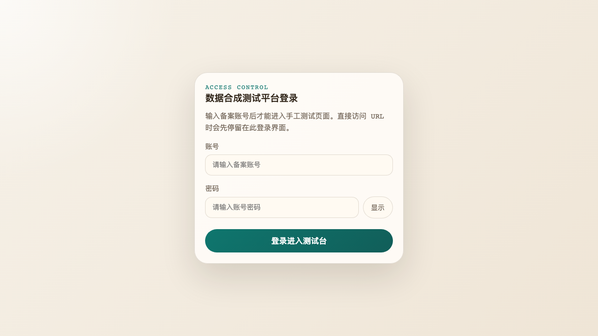
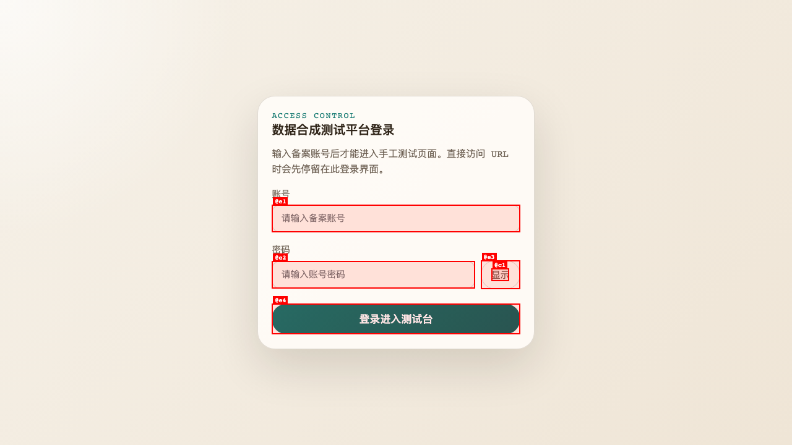
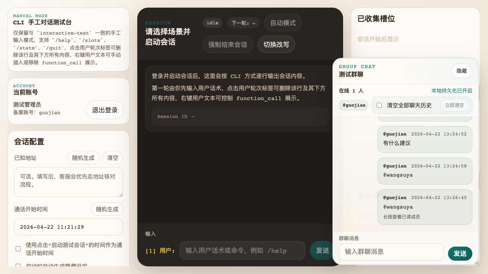
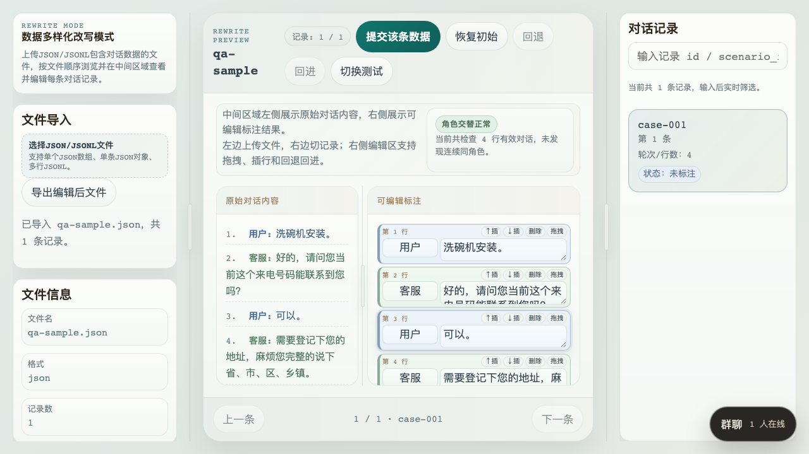

# QA Report: Css-Data-Synthesis-Test Frontend

| Field | Value |
|-------|-------|
| **Date** | 2026-04-22 22:48:30 +0800 |
| **URL** | http://127.0.0.1:8000 |
| **Branch** | main |
| **Commit** | c78ef68 (2026-04-22T22:16:58+08:00) |
| **PR** | — |
| **Tier** | Standard |
| **Scope** | Login gate, manual test shell, rewrite mode import flow, chat overlay behavior |
| **Duration** | ~10 min |
| **Pages visited** | 3 |
| **Screenshots** | 4 |
| **Framework** | FastAPI + frontend SPA |
| **Index** | — |

## Health Score: 88/100

| Category | Score |
|----------|-------|
| Console | 70 |
| Links | 100 |
| Visual | 89 |
| Functional | 92 |
| UX | 81 |
| Performance | 100 |
| Accessibility | 85 |

## Top 3 Things to Fix

1. **ISSUE-001: 登录门禁只遮住视觉层，没有遮住页面语义层** — 未登录页的 DOM 文本里仍然能读到完整手工测试台、改写模式和群聊结构。
2. **ISSUE-002: 登录页首次打开固定报 401 控制台错误** — `/api/auth/me` 未登录时直接打出错误，导致首屏就有红错。
3. **ISSUE-003: 登录后群聊窗默认展开并挡住右侧诊断区** — `已收集槽位` / `运行时状态` 区域首屏被聊天窗遮住，测试台主信息区可见性受影响。

## Console Health

| Error | Count | First seen |
|-------|-------|------------|
| `Failed to load resource: the server responded with a status of 401 (Unauthorized)` | 1 recurring signature | `/` |

## Summary

| Severity | Count |
|----------|-------|
| Critical | 0 |
| High | 1 |
| Medium | 2 |
| Low | 1 |
| **Total** | **4** |

## Issues

### ISSUE-001: 登录门禁只遮住视觉层，没有遮住页面语义层

| Field | Value |
|-------|-------|
| **Severity** | high |
| **Category** | accessibility |
| **URL** | http://127.0.0.1:8000 |

**Description:** 登录页视觉上只显示账号密码框，但未登录状态下做文本提取时，页面仍暴露完整的 Manual Mode、Rewrite Mode、群聊、评审弹窗等隐藏内容。对屏幕阅读器、自动化文本抽取和 DOM 读取来说，门禁没有真正隔离工作台语义层。

**Repro Steps:**

1. 直接访问登录页。  
   
2. 在未登录状态下读取页面文本内容，例如用屏幕阅读器、无障碍树或 DOM 文本抓取。
3. **Observe:** 文本里会出现 `CLI 手工对话测试台`、`数据多样化改写模式`、`测试群聊`、`提交评审` 等本应登录后才暴露的界面内容。

**Evidence excerpt:**

```text
Manual Mode
CLI 手工对话测试台
Rewrite Mode
数据多样化改写模式
Group Chat
测试群聊
Review
本次测试评审
```

---

### ISSUE-002: 登录页首次打开固定报 401 控制台错误

| Field | Value |
|-------|-------|
| **Severity** | medium |
| **Category** | console |
| **URL** | http://127.0.0.1:8000 |

**Description:** 首次打开登录页时，前端会请求 `/api/auth/me`，服务端返回 401，浏览器控制台直接出现红色错误。未登录本身是正常状态，但当前实现把预期态表现成异常噪音。

**Repro Steps:**

1. 打开登录页。  
   
2. 打开控制台。
3. **Observe:** 页面加载完成后立即出现 `401 (Unauthorized)` 资源错误。

**Evidence excerpt:**

```text
Failed to load resource: the server responded with a status of 401 (Unauthorized)
```

---

### ISSUE-003: 登录后群聊窗默认展开并挡住右侧诊断区

| Field | Value |
|-------|-------|
| **Severity** | medium |
| **Category** | ux |
| **URL** | http://127.0.0.1:8000 |

**Description:** 登录进入手工测试台后，群聊窗默认展开在右侧，直接覆盖 `已收集槽位` 和右栏诊断区域。这个面板本来就是测试同学需要持续观察的核心区域，默认首屏被挡住会降低可用性。

**Repro Steps:**

1. 登录进入测试台。  
   
2. 保持默认布局，不做拖拽或隐藏聊天窗。
3. **Observe:** 右上 `已收集槽位` 面板大面积被聊天窗遮住。

---

### ISSUE-004: 改写模式底部聊天悬浮入口会压到右下工作区

| Field | Value |
|-------|-------|
| **Severity** | low |
| **Category** | visual |
| **URL** | http://127.0.0.1:8000 |

**Description:** 在改写模式里隐藏群聊后，右下角的 `群聊 1 人在线` 悬浮入口仍悬在工作区上方。当前样本里它压在右下区域边缘，容易和记录区、翻页区形成视觉冲突。

**Repro Steps:**

1. 登录后切换到改写模式并导入对话文件。  
   
2. 保持群聊为隐藏态。
3. **Observe:** 右下角黑色群聊入口悬浮在工作区上层，侵入改写模式主视图。

---

## Ship Readiness

| Metric | Value |
|--------|-------|
| Health score | 88 |
| Issues found | 4 |
| Fixes applied | 0 |
| Deferred | 4 |

**QA Verdict:** 可进入修复阶段，但不建议把当前前端体验当作“已清洁可回归”的状态。至少应先处理登录门禁语义泄露和首屏聊天遮挡问题。
